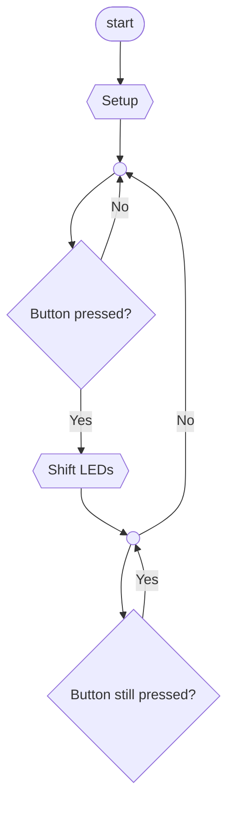

```mermaid
graph TD
  main([start])
  --> setup{{Setup}}
  --> mainLoop(( ))
  --> btnPress{Button pressed?}
  --> |No| mainLoop
  btnPress
  --> |Yes| shift{{Shift LEDs}}
  --> innerLoop(( ))
  --> btnStillPressed{Button still pressed?}
  --> |Yes| innerLoop
  --> |No| mainLoop
```
