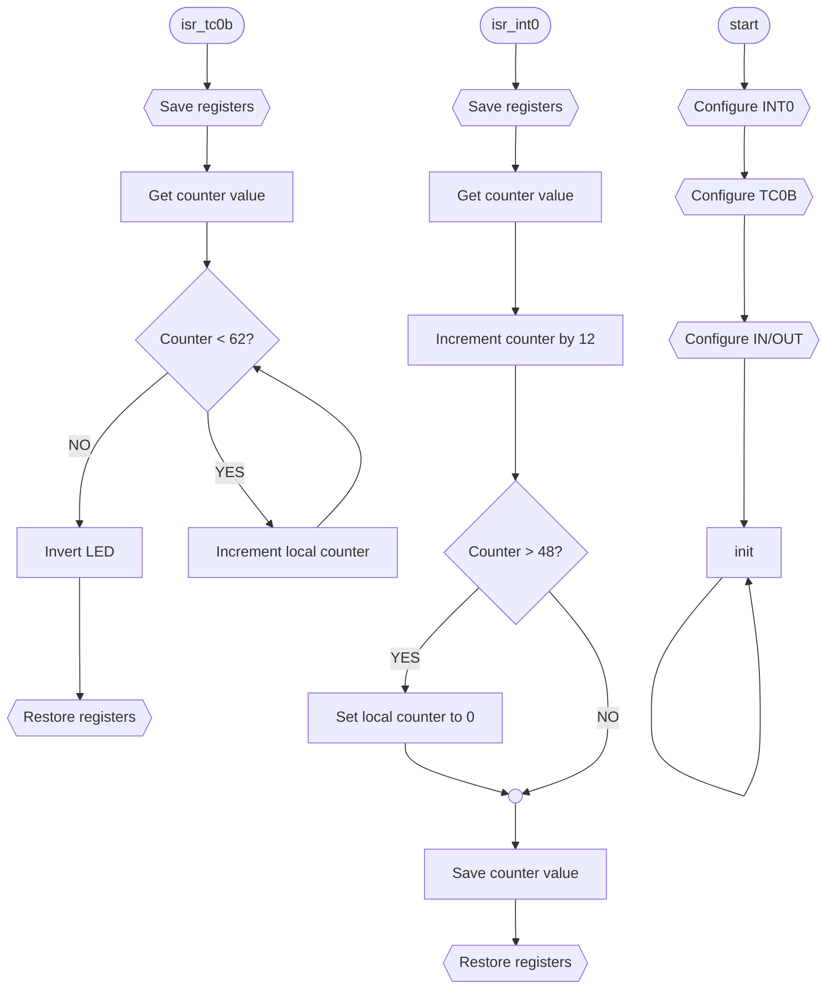

```mermaid

graph TD
  start([start])
  --> cfgInt0{{Configure INT0}}
  -->cfgTc0b{{Configure TC0B}}
  -->cfgInOut{{Configure IN/OUT}}
  -->init
  -->init


  isr_tc0b([isr_tc0b])
  --> save1{{Save registers}}
  --> getCounter[Get counter value]
  --> loop1{Counter < 62?}
  --> |YES| inc[Increment local counter]
  --> loop1
  --> |NO| invert[Invert LED]
  --> restore1{{Restore registers}}

  isr_int0([isr_int0])
  --> save2{{Save registers}}
  --> getCounter1[Get counter value]
  --> inc1[Increment counter by 12]
  --> validate{Counter > 48?}
  --> |YES| localCounter[Set local counter to 0]
  --> join

  validate
  --> |NO| join(( ))
  --> save3[Save counter value]
  --> restore2{{Restore registers}}

```
