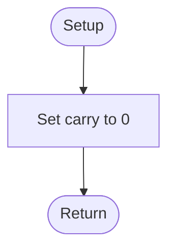
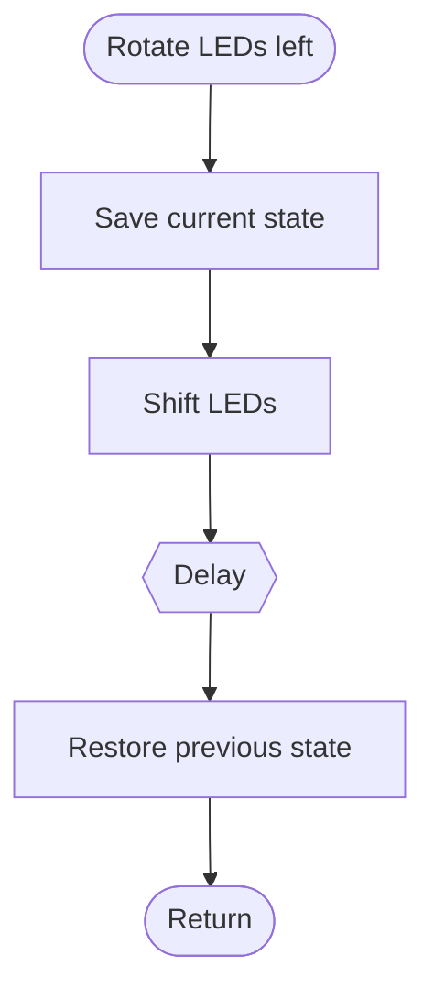
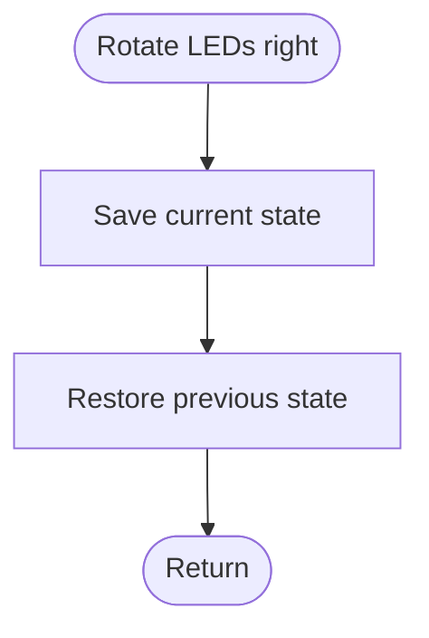

```mermaid
graph TD
    main([Start])
    --> setup{{Setup}}
    --> start(( ))
    --> adjPress{Adjust button pressed?}
    --> |Yes| rol{{Rotate LEDs left}}
    --> selPress
    adjPress
    --> |No| selPress{Selection button pressed?}
    --> |Yes| ror{{Rotate LEDs right}}
    --> start
    selPress
    --> |No| start
```

---

```mermaid
graph TD
  setup([Setup])

  --> carry[Set carry to 0]
  --> return([Return])
```

---

```mermaid
graph TD
  rol([Rotate LEDs left])
  --> save[Save current state]
  --> shift[Shift LEDs]
  --> delay{{Delay}}
  --> restore[Restore previous state]
  --> return([Return])
```

---

```mermaid
graph TD
  ror([Rotate LEDs right])
  --> save[Save current state]

  --> restore[Restore previous state]
  --> return([Return])
```
