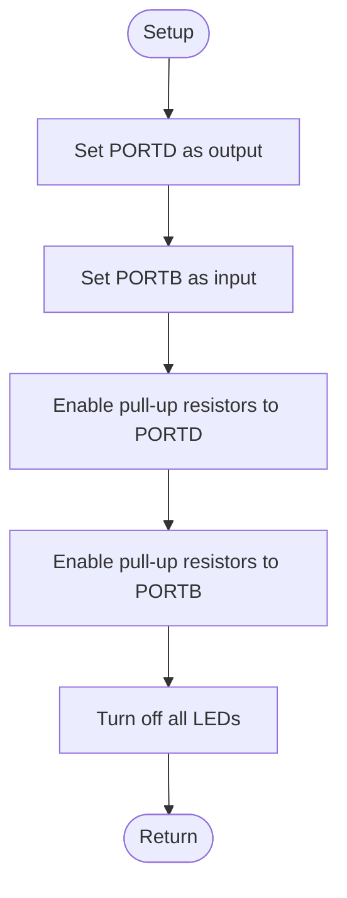
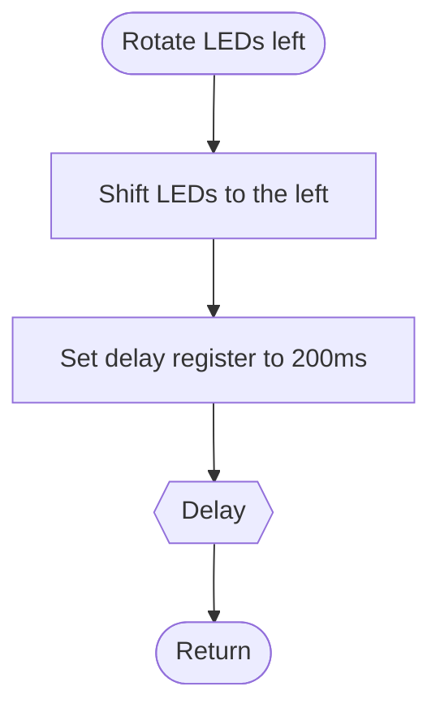
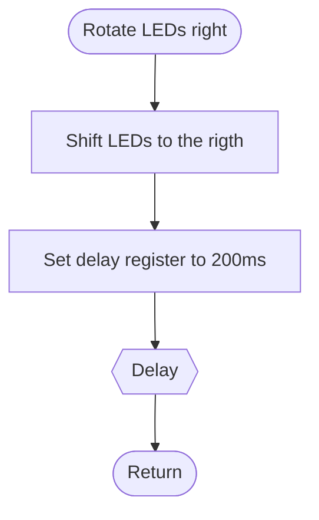

```mermaid
graph TD
    main([Start])
    --> setup{{Setup}}
    --> start(( ))
    --> adjPress{Adjust button pressed?}
    --> |Yes| rol{{Rotate LEDs left}}
    --> selPress
    adjPress
    --> |No| selPress{Selection button pressed?}
    --> |Yes| ror{{Rotate LEDs right}}
    --> start
    selPress
    --> |No| start
```

---

```mermaid
graph TD
  setup([Setup])
  --> portd[Set PORTD as output]
  --> portb[Set PORTB as input]
  --> pullupd[Enable pull-up resistors to PORTD]
  --> pullupb[Enable pull-up resistors to PORTB]
  --> off[Turn off all LEDs]
  --> return([Return])
```

---

```mermaid
graph TD
  rol([Rotate LEDs left])
  --> shift[Shift LEDs to the left]
  --> setDelay[Set delay register to 200ms]
  --> delay{{Delay}}
  --> return([Return])
```

---

```mermaid
graph TD
  rol([Rotate LEDs right])
  --> shift[Shift LEDs to the rigth]
  --> setDelay[Set delay register to 200ms]
  --> delay{{Delay}}
  --> return([Return])
```
